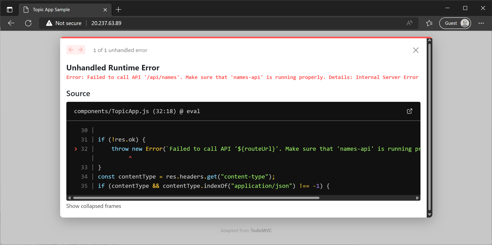

# Contoso project name generator for AKS developer experience demo

This project consists of a [frontend](https://github.com/sabbour/contoso-names-frontend/) written in Node.JS and a [service](https://github.com/sabbour/contoso-names-service) written in C# on top of .NET 6.

## Prerequisites
- Azure subscription
- Domain name to manage using Azure DNS

## Infrastructure setup
- Launch the [Azure Cloud Shell](https://shell.azure.com) and login with your Azure subscription.
- Clone this repository
    ```
    git clone https://github.com/sabbour/contoso-names.git
    ```
- Change into the `contoso-names` directory and run `setup.sh` while providing the required parameters. **Note:** Running this script will provision Azure resources that might incur billing.
    ```
    cd contoso-names
    chmod +x setup.sh
    ./setup.sh
    ```
    
    **Note: ** This will take a few minutes to complete and will provision an Azure Kubernetes Service (AKS) cluster with the recommended add-ons enabled, an Azure Container Registry, an Azure Key Vault with a self-signed certificate, an Azure DNS Zone. The script will also download the cluster's credentials into the cloud shell.

## Deploy the frontend
- Launch the [Azure Cloud Shell](https://shell.azure.com) and login with your Azure subscription.

- Clone the [frontend](https://github.com/sabbour/contoso-names-frontend/) repository.
    ```
    git clone https://github.com/sabbour/contoso-names-frontend.git
    ```

- Change into the `contoso-names-frontend` directory and deploy the Kubernetes manifests.
    ```
    cd contoso-names-frontend
    kubectl create namespace contoso-names
    kubectl apply -f ./manifests --namespace=contoso-names
    ```
- Give it a few minutes and retrieve the Kubernetes service's IP address.
    ```
    kubectl get service contoso-names-frontend --namespace=contoso-names -o jsonpath="{.status.loadBalancer.ingress[0].ip}"
    ```
- Now that you have the service's public IP address, navigate to [http://[contoso-frontend IP address]]() in your browser. The user interface will load but you will receive an error because the backend service hasn't been deployed yet.


## Iterate on the service
### Login and select the Azure subscription
- Open the [service](https://github.com/sabbour/contoso-names-service/) repository with GitHub Codespaces. This will fork the repository under your profile.

GitHub is going to build the codespace and in a few minutes you will be able to access it.


- Install the latest version of the [AKS Developer Tools extension](https://marketplace.visualstudio.com/items?itemName=ms-kubernetes-tools.aks-devx-tools), if it isn't already there.

- Launch the command palette (`Ctrl + Shift + P`) and run the `Azure: Sign in with Device Code` command to login to your Azure subscription.


- If you have access to multiple tenants, select the one you'd like to use by running the `Azure: Select Tenant` command.


- Run the `Azure: Select Subscriptions` command to select the Azure subscription you'd like to use.


### Launch the application in GitHub Codespaces
- Hit `F5` to run the service in the codespace. This will build and launch the application in the codespace and tunnel the exposed endpoint back to your machine. You should now see the API endpoint.


### Generate Dockerfile
- Run the `Azure Developer: Draft a Dockerfile from source code` command.


### Build the container image

### Create a deployment and service

### Debug with Bridge to Kubernetes

### Create a GitHub Actions workflow

## Configure Web Application Routing on the frontend